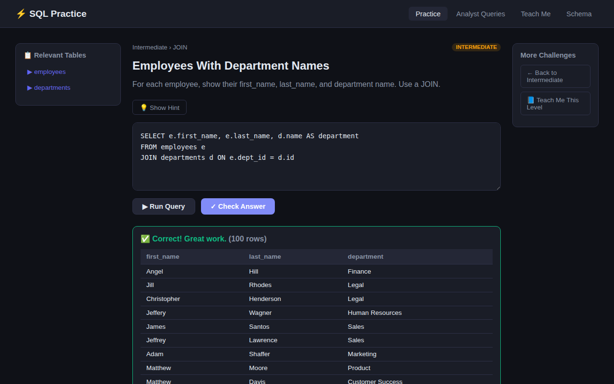
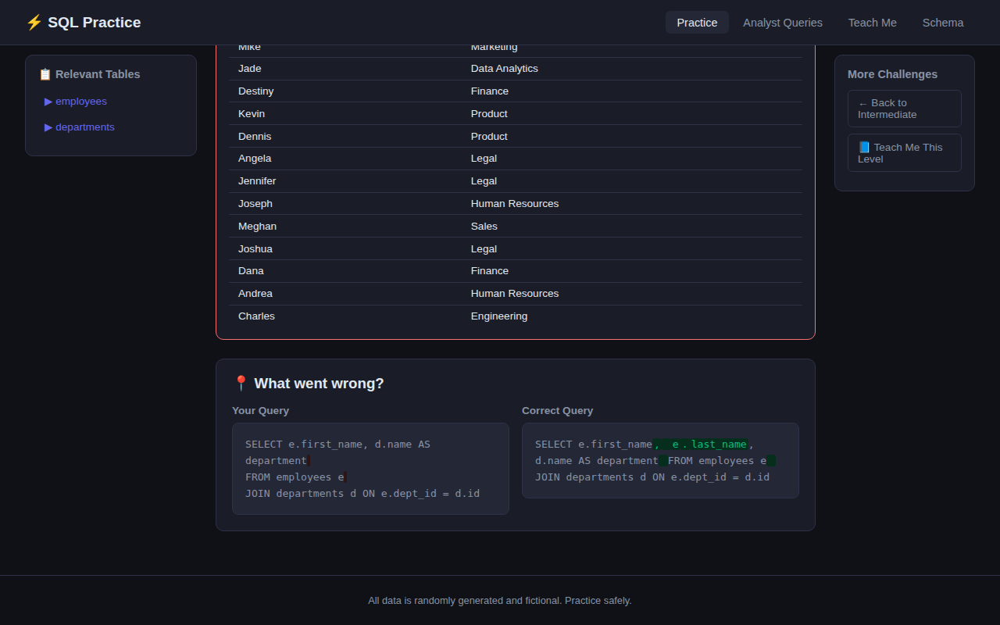

# ⚡ SQL Practice

A browser-based SQL practice environment for aspiring data analysts. Write real queries against a realistic (but 100% fictional, randomly generated) business database and get instant, plain-English feedback — including a visual diff that shows exactly how your query differs from a correct one.

**Live demo:** _add your Render URL here after deploying_



## Features

- **140 challenges** across four tracks:
  - 🌱 **Beginner** (43) — SELECT, WHERE, ORDER BY, LIMIT, DISTINCT, aliases, arithmetic
  - 🔥 **Intermediate** (42) — aggregates, GROUP BY, HAVING, INNER/LEFT JOIN, subqueries, CASE WHEN, string & date functions
  - ⚡ **Advanced** (30) — window functions, CTEs, self joins, UNION/INTERSECT/EXCEPT, EXISTS, correlated subqueries
  - 📊 **Random Analyst** (25) — realistic scenarios: duplicate detection, month-over-month revenue, cohort analysis, rolling averages, customer lifetime value
- **📘 Teach Me** — 22 structured lessons with plain-English explanations, annotated example queries, and a linked practice challenge for each concept
- **Smart feedback when you're wrong:**
  - SQL errors are translated into plain English with fuzzy-matched suggestions ("Did you mean: `employees`?")
  - Wrong answers get a side-by-side, token-level diff of your query vs. a correct one
  - Answers are checked by comparing **result sets**, not query text — any valid approach passes



## How answers are validated

Your query and the reference solution both run against the same SQLite database. The app compares the returned columns and rows (order-insensitive unless the challenge tests ORDER BY), so multiple different-but-correct queries are all accepted.

## Safety

The sandbox is read-only, enforced in three independent layers:

1. A keyword pre-filter rejects INSERT / UPDATE / DELETE / DROP / etc. before execution
2. SQLite's authorizer callback denies every action except reads at the engine level
3. Queries run in a watchdog thread with a 5-second timeout and a 500-row result cap

## Tech stack

| Layer | Choice |
|---|---|
| Backend | Python 3.11+, Flask |
| Database | SQLite (created and seeded automatically on first run) |
| Fake data | Faker (seeded — data is deterministic and fully fictional) |
| Editor | CodeMirror 5 via CDN, with a styled plain-textarea fallback |
| Frontend | Vanilla JS + CSS, no build step |

## Run locally

```bash
pip install -r requirements.txt
python app.py
# open http://localhost:5000
```

The database (`database/practice.db`) is created and seeded automatically the first time the app starts.

## Deploy free on Render

1. Fork or push this repo to your GitHub account
2. On [render.com](https://render.com): **New → Web Service** → select this repo
3. Render reads `render.yaml` automatically — accept the defaults and click **Deploy**
4. You'll get a permanent public URL in a few minutes

(Free instances sleep after inactivity; the first request after a while takes ~30–50s to wake.)

## Project structure

```
app.py                  Flask routes (pages + JSON API)
database/               Schema definition + Faker seeding
challenges/             140 challenge definitions grouped by level
lessons/                22 lesson definitions grouped by level
utils/sql_runner.py     Sandboxed execution + result-set comparison
utils/error_parser.py   Error → plain English + token diff builder
templates/, static/     UI (Jinja2, CSS, vanilla JS)
```

## Disclaimer

All data is randomly generated and fictional. Any resemblance to real people or businesses is coincidental.
